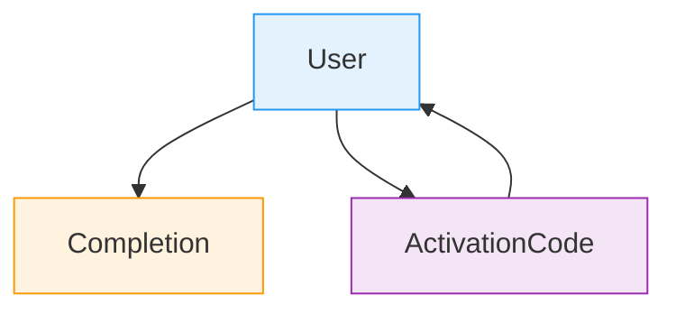
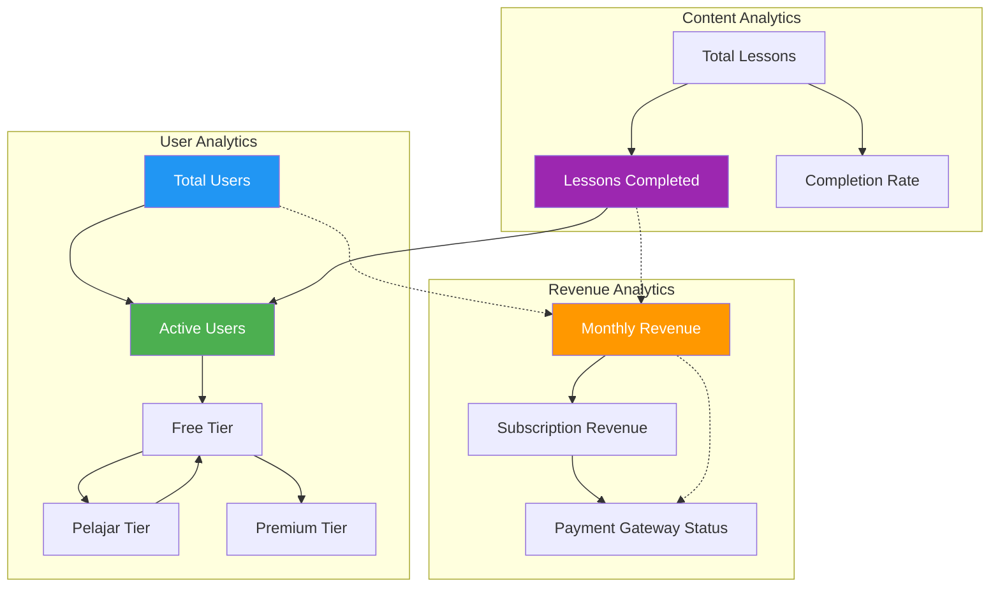
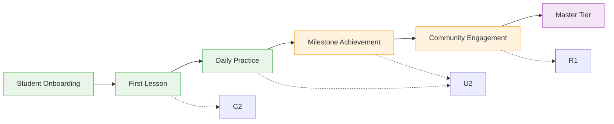
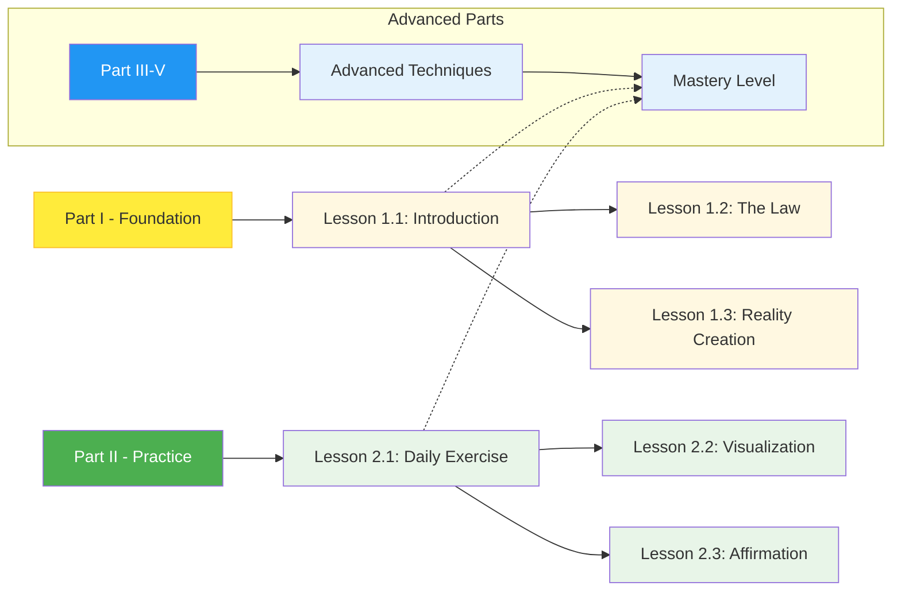
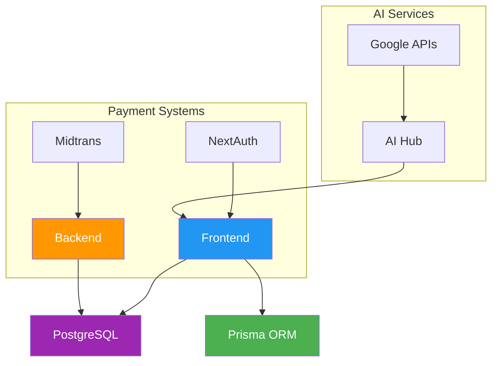
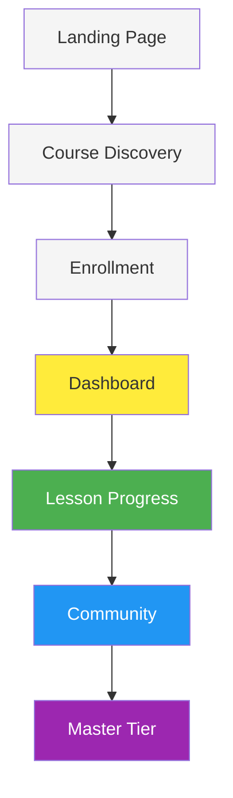
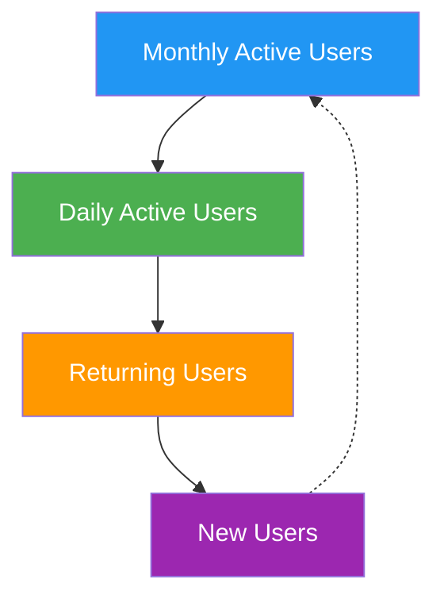
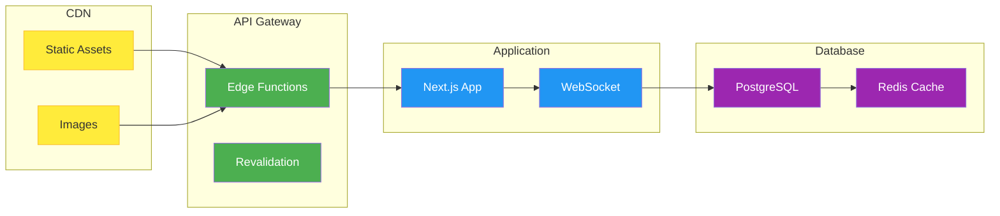

# Data Visualization for WEBLOASKECIL Platform

## Platform Overview
This is a comprehensive learning platform focused on Neville Goddard's teachings with 10 Parts and 49 Lessons.

## Current Database Schema

## Platform Analytics Dashboard

## Student Progress Timeline

## Course Structure Visualization

## Technology Stack Dependencies

## User Journey Flow

## Platform Metrics

| Metric | Current Status | Target |
|--------|---------------|--------|
| Total Users | Growing | 5,000/month |
| Lesson Completion | 35% | 50% |
| Engagement Rate | 60% | 80% |
| Revenue Growth | Stable | 25%/year |
| User Retention | 70% | 85% |

## Deployment Architecture

